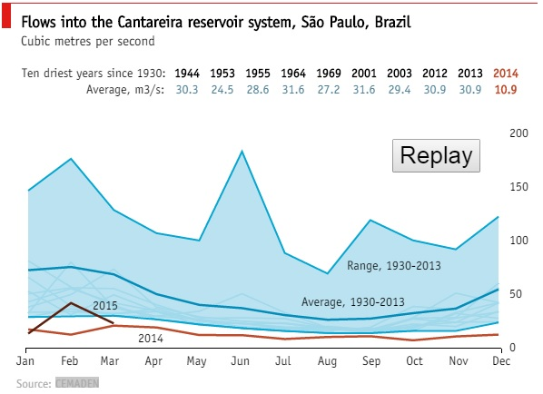

**Figure 1** (*From source article*)

*Source article*: The Econmist <http://www.economist.com/blogs/graphicdetail/2015/03/sao-paulo-drought>

What you see here in *Figure 1* is the amount of water flow into the *Cantereira reservoir system, Sao Paulo, Brazil* over the years. This chart clearly highlights the fact that the water in-flow since 2014 has been droping below the average levels.
The author in this original article attributes the low in-flow towards rainwater not being routed to the reservoir due to deforestation. There are no charts depicting the correlation between in-flow and rainfall to justify the main theme of the article.

My suggestions on improving the visualization:

- A bubble chart can visualize such missing correlations across the in-flow and rainfall over a period as shown below in Figure 2.

```{r, echo=FALSE}
require(ggplot2)
dfFlowPrec2013 = read.csv(file="FlowPrecipitation_2013.csv")
#parse as date ojbect
dfFlowPrec2013$Date <- as.Date(dfFlowPrec2013$Date, format("%m/%d/%Y"))
#parse as integer ojbect
dfFlowPrec2013$InFlow.cms. <- as.integer(dfFlowPrec2013$InFlow.cms.)
dfFlowPrec2013$Precipitation.in. <- as.integer(dfFlowPrec2013$Precipitation.in.)
#create a bublle chart using ggplot2
p <- ggplot(dfFlowPrec2013, aes(dfFlowPrec2013$Date, dfFlowPrec2013$InFlow.cms., size=dfFlowPrec2013$Precipitation.in.))
p <- p+geom_point(colour="blue") +scale_size_area(name = "Precipitation (inches)")+geom_text(size=3, label="")
p <- p+ylab("Water in-flow (cfs)")+xlab("Month")
p <- p+ggtitle("Water in-flow Vs. Precipitation")
p
```

**Figure 2** (*My suggestion #1*)

The bubble size in *Figure 2* represents the amount of precipitation (rainfall+snow+hail) in inches that was recorded around the reservoir. The question this chart addresses is - whether increase in rainfall increases the in-flow the reservoir. (See *disclaimer* below on the data). It will be ideal to visualize this information across the years (not added multiple years to keep it simple).

- Another chart that can facilitate in understanding the in-flow patterns is to plot in-flow changes over a period of time.
A multi-line graph of in-flow data across the years is shown below in *Figure 3*. 

```{r, echo=FALSE}
dfFlowVsPrec = read.csv("FlowPrecipitation_2013_2009_2.csv")
colors <- rainbow(2)
linetype <- c(1:2) 
plotchar <- seq(18,18+2,1)
plot(dfFlowVsPrec[,1],dfFlowVsPrec[,2], type="b",ylim=c(min(dfFlowVsPrec[,-1]),max(dfFlowVsPrec[,-1]+6000)),col="red",lty=0,ylab="In-Flow (cfs)",lwd=0.1,xlab="Months")
lines(dfFlowVsPrec[,2],type="b",lwd=1.5, lty=linetype[1], col=colors[1], pch=plotchar[1])
lines(dfFlowVsPrec[,4],type="b",lwd=1.5, lty=linetype[2], col=colors[2], pch=plotchar[2])
title("Water in-flow over the years", "")
legend("topleft",legend=c("2013","2012"),lty=linetype,col=colors,pch=plotchar,title="Year")
```

**Figure 3** (*My suggestion #2*)

With this chart it is easy to visualize the outlier years (if any). If any outlier years exists then we can incoporate any external knowledge that may explain the pattern.
For example if we see in-flows has been gradually reducing since 2002 and we perhaps also know that a lot of new civil projects began their construction during that time which required deforestation then some sort of correlation could be drawn between in-flow and deforestation.

- Its clear from the chart that the highest in-flow is around the 125cfs and this could very well be an outlier year. Most of the lines in the chart are below the average in-flow. It could be that this outlier year has increased the average. There is really no way of telling this for sure by looking at the graph. It would be nice to visualize the standard deviation as well. A box-plot could instantly show the outlier years.

- The position of the y-axis and its labels in the orignal chart (Figure 1) to the left would have made the chart more readable at least to folks who write from left to right as compared to right to left.

- The Replay button in the original chart (Figure 1) draws the in-flows for each year (Can click on the Replay botton only via the original article). The animation is so swift that it's hard to comprehend how the in-flow is changing over time - it does not really serve much purpose in telling a story. Perhaps what might be of some use is if the speed of the animation can be controlled. 

- The data about the ten driest years and their average has not been visualized in the chart in any way. It's a traditional way of reporting data in a tabular form. 

***Disclaimer:** It was hard to obtain the raw data on Rainfall, In-Flow for Cantareira reservoir and hence for illustration purpose I have used data from another location in the US (Hinckley reservoir for Inflow and Hekimer County, NY for Rainfall). Again do not interpret data since it's hard to say if Rainfall at Hekimer County contributes to Hinckley reservoir. Used only for illustration purpose.*

The data sources that were used to create Figures 2 & 3.

1. Precipitation In-Flow data (Hinckley reservoir): <http://www.canals.ny.gov/waterlevels/hinckley/hinckleywaterlevels.cgi>

2. Rainfall data (Hekimer County): <http://www.wunderground.com/history/airport/KRME/2013/1/1/CustomHistory.html?dayend=31&monthend=12&yearend=2013&req_city=&req_state=&req_statename=&reqdb.zip=&reqdb.magic=&reqdb.wmo=&MR=1>


R scripts for the charts:

For *Figure 2*:
```
require(ggplot2)
dfFlowPrec2013 = read.csv(file="FlowPrecipitation_2013.csv")

#parse as date ojbect
dfFlowPrec2013$Date <- as.Date(dfFlowPrec2013$Date, format("%m/%d/%Y"))

#parse as integer ojbect
dfFlowPrec2013$InFlow.cms. <- as.integer(dfFlowPrec2013$InFlow.cms.)
dfFlowPrec2013$Precipitation.in. <- as.integer(dfFlowPrec2013$Precipitation.in.)

#create a bublle chart using ggplot2
p <- ggplot(dfFlowPrec2013, aes(dfFlowPrec2013$Date, dfFlowPrec2013$InFlow.cms., size=dfFlowPrec2013$Precipitation.in.))
p <- p+geom_point(colour="blue") +scale_size_area(name = "Precipitation (inches)")+geom_text(size=3, label="")
p <- p+ylab("Water in-flow (cfs)")+xlab("Month")
p <- p+ggtitle("Water in-flow Vs. Precipitation")
p

```

For *Figure 3*:

```
dfFlowVsPrec = read.csv("FlowPrecipitation_2013_2009_2.csv")
# choose distinct colors from rainbow built-in object. 
#Rainbow is not recommended for color blind. 
#There are other packages which essentially allows to choose a range of colors that are distinct.
#hard coded param values for simplicity.
colors <- rainbow(2)
# choose line type
linetype <- c(1:2) 
plotchar <- seq(18,18+2,1)
# plot API only draw the skeleton.
plot(dfFlowVsPrec[,1],dfFlowVsPrec[,2], type="b",ylim=c(min(dfFlowVsPrec[,-1]),max(dfFlowVsPrec[,-1]+6000)),col="red",lty=0,ylab="In-Flow (cfs)",lwd=0.1,xlab="Months")
# draw the lines for each year.
lines(dfFlowVsPrec[,2],type="b",lwd=1.5, lty=linetype[1], col=colors[1], pch=plotchar[1])
lines(dfFlowVsPrec[,4],type="b",lwd=1.5, lty=linetype[2], col=colors[2], pch=plotchar[2])
title("Water in-flow over the years", "")
legend("topleft",legend=c("2013","2012"),lty=linetype,col=colors,pch=plotchar,title="Year")

```

Some other R scripts that were used to transform the raw data into the csv to create Figure 2 & 3.

```
require(ggplot2)
dfReservoir2013 = read.csv(file="2013-hinckley-data.csv", sep=",", colClasses=c(NA, "NULL", "NULL", "NULL", "NULL", "NULL", NA, "NULL", "NULL", "NULL", "NULL", "NULL"))

dfPrecipitation2013 = read.csv(file="Hekimer_weather_data_2013.csv", sep=",", colClasses=c(NA, "NULL", "NULL", "NULL", "NULL", "NULL", "NULL", "NULL", "NULL", "NULL", "NULL", "NULL", "NULL", "NULL", "NULL", "NULL", "NULL", "NULL", "NULL", NA, "NULL", "NULL", "NULL"))

dfReservoir2013 <- dfReservoir2013[-c(1),]

dfReservoir2013 <- dfReservoir2013[order(as.Date(dfReservoir2013$Date, format("%m/%d/%Y"))),]

dfReservoir2013$Date2 = as.Date(dfReservoir2013$Date, format("%m/%d/%Y"))
dfPrecipitation2013$Date2 = as.Date(dfPrecipitation2013$EST)
dfFlowVsPrecipitation = merge(dfReservoir2013, dfPrecipitation2013, by="Date2")

dfFlowVsPrecipitation$Date <- NULL
dfFlowVsPrecipitation$Nine.Mile.Feeder.Discharge <- NULL
dfFlowVsPrecipitation$EST <- NULL

```

